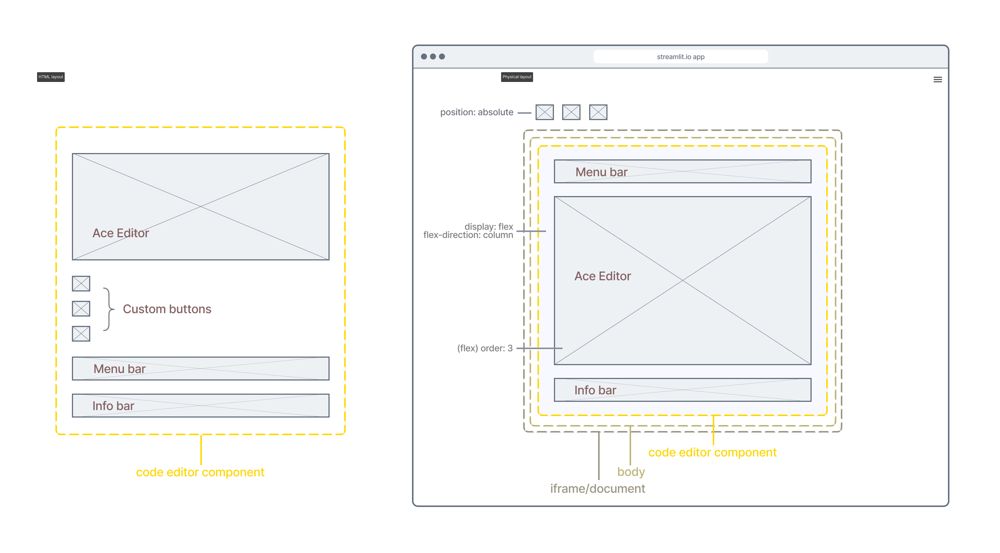

## Advanced customization
In the previous section, there is an issue with the appearance of the info and menu bar examples. The top two corners of the editor component are rounded which does not allow for a seemless connection of the left and right edges with the edges of the info/menu bar. On top of this, you might want the bars to appear on the bottom or even on the sides of the editor instead of on top. This is where `css` and `style` attributes really come in to play. 

To get a better understanding of how to use these attributes, we need to go over the layout of the Code Editor component.

### Code Editor component layout

[st_image]: # ("./test/resources/code_editor_layout.png")


On the left (in the diagram) is the layout of the Code Editor component in the HTML/DOM. As you can see, it is relatively flat. On the right is the physical layout of the Code Editor component in the Streamlit app. Here, there are somethings to note. By default, the Code Editor component has its CSS `display` property set to "flex" and its `flex-direction` property set to "column". This means that Code Editor will stack its inner components on top of one another in a column. Additionally, the Ace Editor component has its CSS `order` property set to "3". Altogether, this provides a default setup that allows for easy rearrangment of the stacking order of the components inside the Code Editor. For example, setting the `order` property of the info bar component to a value less than 3 will put it above the Ace Editor like in the examples in the previous section. Setting it to 3 or greater will put the info bar below.')
''Custom buttons are not positioned like the Ace Editor, info bar, and menu bar components are. By default, they have their CSS `position` property set to "absolute" which makes it easier to position them anywhere within the iframe/document that contains the Code Editor component. ''')

### Customizing the Ace Editor
The Ace Editor inside of Code Editor is highly configurable. There are so many configuration options in fact, that the decision was made to split them up into three groups: general properties, editor properties, editor options.
- Set general properties by passing a dictionary to the `props` argument of the `code_editor` function. You can find the list of the properties in this group [here](https://github.com/securingsincity/react-ace/blob/master/docs/Ace.md).
- Set editor properties by passing a dictionary to the `editor_props` argument of the `code_editor` function. You can find a list of the properties in this group [here](https://github.com/securingsincity/react-ace/blob/master/src/types.ts)
- Set editor options by passing a dictionary to the `options` argument of the `code_editor` function. You can find a list of the properties in this group [here](https://github.com/ajaxorg/ace/wiki/Configuring-Ace#editor-options)

[st_status]: # ("**Note:** The general props group actually contains the other two groups as subgroups. The decision to use three different arguments \(of `code_editor` function\) is to allow you to set properties in each of the groups separately to simplify things, but you can just set everything via the `props` argument if you desire.", "info")
>[!NOTE]
>The general props group actually contains the other two groups as subgroups. The decision to use three different arguments (of `code_editor` function) is to allow you to set properties in each of the groups separately to simplify things, but you can just set everything via the `props` argument if you desire.

[st_status]: # ("**Warning:** Currently, Code Editor allows access to pretty much all of the Ace Editor's configuration options including the callback functions which can allow you to pass in code that will be executed on the frontend. **_This is not secure!!_** Some of these options might be removed in the future.", "warning")
>[!WARNING]
>Currently, Code Editor allows access to pretty much all of the Ace Editor's configuration options including the callback functions which can allow you to pass in code that will be executed on the frontend. **_This is not secure!!_** Some of these options might be removed in the future.

### Style and CSS
Code Editor and the components inside (Ace Editor, Info/Menu bars, and buttons) all have a way to set their `style` property. With the exception of Ace Editor and outer containers (like Code Editor), this is done via the `style` attribute of the corresponding dictionary. For example, the `style` attribute of the info bar dictionary is used to set the `style` property of the info bar component. In contrast, Ace Editor's `style` property is set via the `style` attribute in the dictionary you give to the `props` argument of the `code_editor` function. The style attribute corresponding to the Code Editor (outermost container labeled "Code Editor" in the diagram) should be in the dictionary you give to the function's `component_props` argument/parameter

[setting_style_code_editor]: # ()
```python
# style dict for Ace Editor
ace_style = {"borderRadius": "0px 0px 8px 8px"}

# style dict for Code Editor
code_style = {"width": "100%"}

# set style of info bar dict from previous example
info_bar["style"] = {**info_bar["style"], "order": "1", "height": "2.0rem", "padding": "0rem 0.6rem", "padding-bottom": "0.2rem"}
response_dict = code_editor(your_code_string, height=20, info=info_bar, props={"style": ace_style}, component_props={"style": code_style})
```

What if you want to not only style the component but also the elements inside of it? This is where `css` attributes come into the picture. You can pass in CSS to be applied to the component and its children. The way this CSS string is added to the already existing CSS is by prepending the automatically generated class name (given to the component) to the selectors of all rule sets in the string and any property-value pairs that are not in a rule set are added to a general rule set with the generated class name as the selector. In the following example, a CSS string is passed to Code Editor's `css` property: 

[setting_css_code_editor]: # ()
```python
# CSS string for Code Editor
css_string = '''
font-weight: 600;
&.streamlit_code-editor .ace-streamlit-dark.ace_editor {
  background-color: #111827;
  color: rgb(255, 255, 255);
}
&.streamlit_code-editor .ace-streamlit-light.ace_editor {
        background-color: #eeeeee;
        color: rgb(0, 0, 0);
}
'''

# same as previous example but with CSS string
response_dict = code_editor(your_code_string, height=20, info=info_bar, props={"style": ace_style}, component_props={"style": code_style, "css": css_string})
```

Passing in the `css_string` results in the following CSS:

[css_result_code]: # ()

"jBzdJR" is one of the generated class names given to the outermost Code Editor component HTML element.

[st_status]: # ("**Note:** The ampersand \('&'\) in the CSS string is replaced with a class name that is generated when the component is first constructed. If a selector doesnt contain an ampersand, the generated class name is prepended and separated by a space. This means that you cannot select an element outside of the component. ", "info")
>[!NOTE]
>The ampersand ('&') in the CSS string is replaced with a class name that is generated when the component is first constructed. If a selector doesnt contain an ampersand, the generated class name is prepended and separated by a space. This means that you cannot select an element outside of the component.

[st_status]: # ("**Tip:** You can use the ampersand to make the css selector more specific which allows you to override existing CSS rules pertaining to the element you want to style. Take a look at the `css_string` in info bar example from the previous section for examples of how this is done.", "success")
>[!TIP]
>You can use the ampersand to make the css selector more specific which allows you to override existing CSS rules pertaining to the element you want to style. Take a look at the `css_string` in info bar example from the previous section for examples of how this is done.

The dictionaries used to add Info/Menu bars also have a `css` attribute which you can use to style the Info/Menu bar components and their children. 

[st_status]: # ("**Note:** Since the Info/Menu bars and Custom buttons are inside \(and thus children\) of the Code Editor component, you can style all of them via Code Editor's `css` property. Reasons you might opt for using the `css` attribute of the Info/Menu bar dictionaries instead include better organization and improving integration with other Code Editors \(reusability\). Each of these dictionaries should have everything needed to fully setup a component.", "info")
>[!NOTE]
>Since the Info/Menu bars and Custom buttons are inside (and thus children) of the Code Editor component, you can style all of them via Code Editor's `css` property. Reasons you might opt for using the `css` attribute of the Info/Menu bar dictionaries instead include better organization and improving integration with other Code Editors (reusability). Each of these dictionaries should have everything needed to fully setup a component.

#### Adding classes
You can add a class to a component you are adding using the `class` attribute of the dictionary you pass in to the `code_editor` function. This can make it easier to target a component and its children using CSS.
Furthermore, component dictionaries that have a `classToggle` attribute allow you to choose a class that you can toggle on the component via commands.

#### Global styles
What if you want to style the `body` element, the `html` document, or anything outside of the `CodeEditor` component? This can be done by adding global styles. You can add global styles by passing in a CSS string to the `globalCSS` attribute of the `component_props` dictionary.

[st_status]: # ("**Tip:** You can change global CSS variables via the `globalCSS` attribute. This can be an easier and more efficient way to customize the two built-in themes \('streamlit-dark' and 'streamlit-light'\) which rely on several CSS variables. ", "success")
>[!TIP]
>You can change global CSS variables via the `globalCSS` attribute. This can be an easier and more efficient way to customize the two built-in themes ('streamlit-dark' and 'streamlit-light') which rely on several CSS variables.

Unlike CSS you might add using `st.markdown`, the `globalCSS` attribute allows you to customize the styling of a specific Code Editor component without affecting other instances in the streamlit app.

#### Demo
[demo_code_editor]: # ()
```python
# Load custom buttons from file
with open('example_custom_buttons_bar_adj.json') as json_button_file:
    custom_buttons = json.load(json_button_file)

# Load Info Bar from file
with open('example_info_bar.json') as json_info_file:
    info_bar = json.load(json_info_file)

# Load Code Editor CSS from file
with open('code_editor.scss') as css_file:
    css_text = css_file.read()

# construct component props dictionary (->Code Editor)
comp_props = {"css": css_text, "globalCSS": ":root {--streamlit-dark-background-color: #111827;}"}

# construct props dictionary (->Ace Editor)
ace_props = {"style": {"borderRadius": "0px 0px 8px 8px"}}

# add code editor component
response_dict = code_editor(your_code_string,  height = [19, 22], theme="contrast", buttons=custom_buttons, info=info_bar, component_props=comp_props, props=ace_props) 

# handle response to the Run button being clicked (command: submit)
if response_dict['type'] == "submit" and len(response_dict['text']) != 0:
    st.write("Response type: ", response_dict['type'])
    st.code(response_dict['text'], language=response_dict['lang'])
```